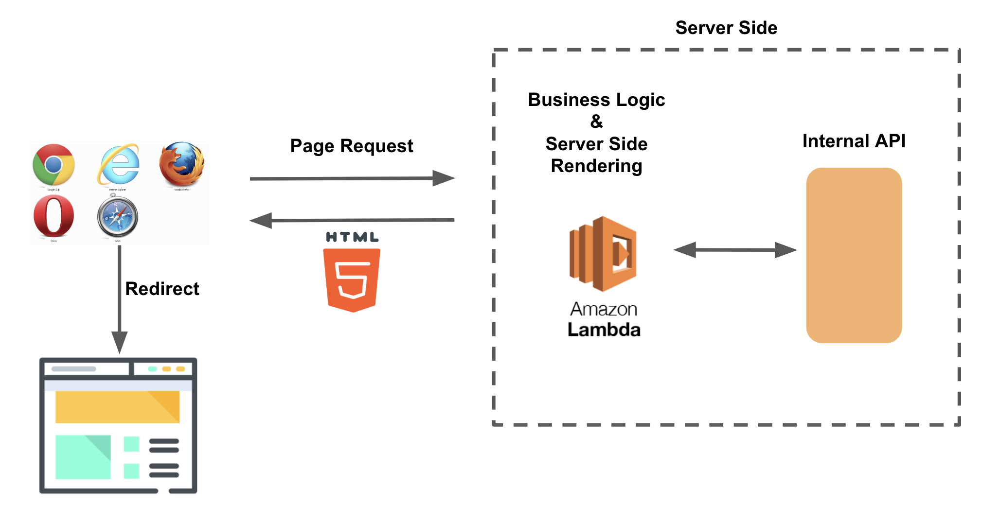
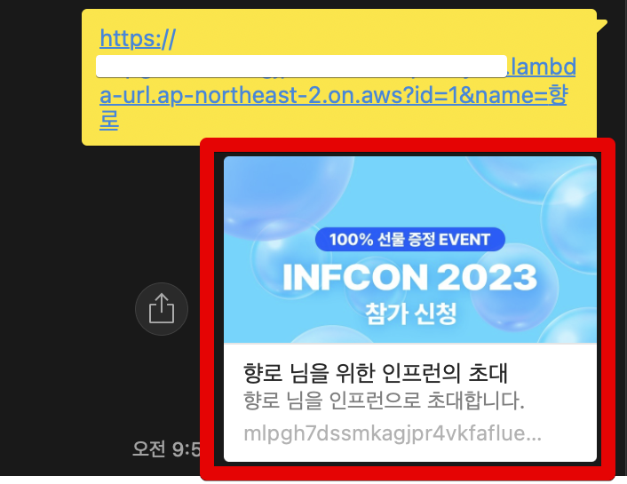
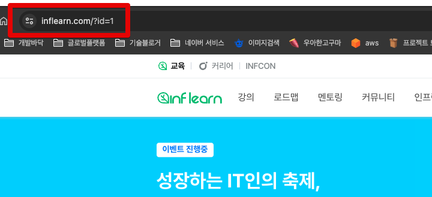

# AWS Lambda를 활용한 동적 Redirect Server 구축하기 (Dynamic HTML Serving)

기존 프로젝트에서 신규로 페이지를 만들었지만, 해당 페이지의 공유 링크는 기존 프로젝트의 meta tag가 아니라 신규 페이지 전용 meta tag 가 필요할 때가 종종 있다.  

카톡방 공유 링크의 미리보기나 여러 크롤러들의 수집등에 유리함을 얻기 위해서는 [Server Side에서 meta tag를 만들어서 HTML을 내려주는 것이 좋다](https://stackoverflow.com/questions/64197301/does-setting-meta-tags-in-javascript-work-without-server-side-rendering).  
  
하지만 아래와 같은 환경이라면 이렇게 Server Side를 동적으로 그려내기가 어려울 수 있다.

- 기존 프로젝트의 레거시로 인해서 동적으로 Server Side에서 meta tag를 수정하기가 어렵거나
- SPA로 구축되어 단일 HTML로만 관리되고 있어 Server Side에서 meta tag 를 수정하기 어렵거나

그래서 **원하는 meta tag를 가진 공유 링크만 담당하는 Redirect 서버**가 있으면 유용하다.



이런 Redirect 서버는 24시간 내내 실행될 필요가 없지만, 많은 트래픽이 들어왔을때 이에 대해 SLA가 보장될 필요가 있다.  
  
그래서 AWS Lambda를 활용하기에 적절하다.  
이번 시간에는 **AWS Lambda를 활용하여 동적으로 HTML을 제공**하는 환경을 구축하고자 한다.

## 해결

AWS Lambda 콘솔로 접속하여 "블루프린트 사용" 을 선택하여, `server` 를 검색해보면 아래와 같이 `server-side rendered web page` 를 찾을 수 있다.  
해당 블루프린트를 선택한다.


해당 Lambda가 URL을 가질 수 있도록 함수 URL 의 승인 박스를 체크한다.


해당 블루프린트는 node 14 환경이다.  
이대로 진행해도 무방하나, node 버전을 업데이트하여 좀 더 최신의 문법을 사용할 수 있도록 한다.  
  
런타임 설정 -> 편집 으로 이동하여


Node 18을 선택한다.


Server Side Rendering 을 지원하기 위해 기본적으로 `index.html` 과 `index.js` 가 생성되어있다.  

ESM을 쓰기 위해 `index.js` 파일의 확장자를 `.mjs`로 교체해준다.


이제 원하는 대로 렌더링 결과물을 내려줄 수 있도록 코드 작업을 진행한다.

### 코드

코드 작업에서는 크게 2가지 요구조건을 달성한다.

- Request Parameter 에 맞춰 meta tag가 Server Side에서 동적으로 생성된다.
- 렌더링된 HTML 페이지 접근시 원하는 다른 페이지로 리다이렉트 한다.
  - 여기서는 `https://inflearn.com?id={id}` 로 리다이렉트 한다.
- 렌더링 되는 페이지에도 파라미터를 전달한다.

실제 로직을 수행할 `.mjs` 파일의 코드는 다음과 같다.

**index.mjs**

```js
import fs from "fs";
const html = fs.readFileSync('index.html', { encoding:'utf8' });

export const handler = async (event, context) => {
    console.log(`event: ${JSON.stringify(event)}`);

    const id = event.queryStringParameters?.id;
    const userName = event.queryStringParameters?.name;
    const body = html
                .replace(/{userName}/g, userName || '')
                .replace(/{id}/g, id || '');
                
    const response = {
        statusCode: 200,
        headers: {
            'Content-Type': 'text/html',
        },
        body,
    };
    return response;
};
```

- `event.queryStringParameters`가 Request Parameter 객체이므로, 여기서 원하는 파라미터값을 가져온다.
- index.html을 가져와서 (`fs.readFile`) 전달받은 파라미터로 내용물을 교체 (`html.replace`) 한다. 
- HTML로 응답 (`'Content-Type': 'text/html'`) 을 내려준다.

다음은 실제 서버에서 렌더링될 HTML이다.  

**index.html**

```html
<!DOCTYPE html>
<html lang='ko'>
  <head>
    <meta charset="utf-8" />
    <meta http-equiv="x-ua-compatible" content="ie=edge" />
    <meta name="viewport" content="width=device-width, initial-scale=1, shrink-to-fit=no" />
    <meta property='og:title' content='{userName} 님을 위한 인프런의 초대'>
    <meta property='og:description' content='{userName} 님을 인프런으로 초대합니다.'>
    <meta property="og:image" content='https://cdn.inflearn.com/public/courses/331266/cover/ac7b8703-f6c3-4ae6-b1e7-2073e458b0d5/331266-1.png' />
    <title>인프런 바로가기</title>
    <script type="text/javascript">
      window.location.replace('https://inflearn.com?id={id}')
    </script>
</head>
</html>
```

- 각종 meta tag들을 `.mjs` 파일과 매칭될 수 있는 변수로 등록한다.
  - `{userName}`, `{id}` 등등 
- 원하는 페이지로 리다이렉트 되도록 `script`를 작성한다.

이외에도 필요한 여러가지 로직을 `index.mjs`, `index.html` 등에 추가할 수 있다.  
  
작성이 완료되었다면 "Deploy" 버튼을 클릭하여 배포하고, Lambda 페이지 우측 상단에 있는 "함수 URL" 를 복사하여 필요한 파라미터와 함께 카톡으로 전달해본다.


여기서는 파라미터로 `id` 와 `name` 을 사용하였는데, 이들과 함께 URL을 만들어서 전달해보면, 다음과 같이 각종 메타 태그가 잘 생성된 것을 알 수 있으며



해당 링크 클릭시 원하던 페이지로 리다이렉트까지 되는 것을 확인할 수 있다.



### 추가

이렇게 만든 Lambda Redirect 서비스에 Custom Domain을 붙이는 것도 `Route53 + CloudFront`를 활용하면 가능하다.  

- [Configuring a custom domain for AWS Lambda Function URLs](https://medium.com/@walid.karray/configuring-a-custom-domain-for-aws-lambda-function-url-with-serverless-framework-c0d78abdc253)

## 마무리

AWS Lamda가 단순히 API의 대체제 역할만 하는 것은 아니다.  
관리를 위임한 서버 환경이라고 생각해보면 그동안 애플리케이션 서버가 해주던 많은 역할들을 손쉽고 + 신경쓸게 적은 환경을 구축할 수 있다.