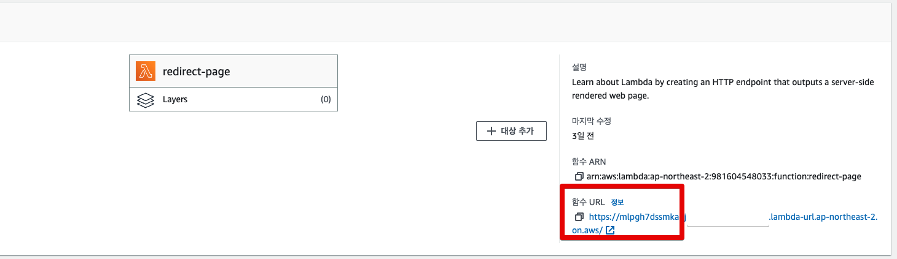

# AWS Lambda를 활용한 동적 Redirect Server 구축하기 (Dynamic HTML Serving)

## 문제

AWS Lambda를 활용하여 동적으로 HTML을 제공하는 서버를 구축하고자 한다.


- 브라우저에서 직접 메타태그를 수정하는 것은 실제로 
- 결국 서버에서 HTML을 내려줄때 메타 태그가 이미 반영된 채로 내려줘야만 한다. 
  - 동적 서버 렌더링
- 상황에 따라 **private 한 서버 API를 호출**해서 HTML을 만들고 싶다.

## 해결

"블루프린트 사용" 을 선택한다.


index.html과 index.js가 생성된다.  

이대로 진행해도 무방하나, node 버전을 업데이트하여 좀 더 최신의 코드로 작업을 진행한다.


ESM을 쓰기 위해 js 파일의 확장자를 `.mjs`로 교체해준다.


```html
<!DOCTYPE html>
<html lang='ko'>
  <head>
    <meta charset="utf-8" />
    <meta http-equiv="x-ua-compatible" content="ie=edge" />
    <meta name="viewport" content="width=device-width, initial-scale=1, shrink-to-fit=no" />
    <meta property='og:title' content='{userName} 님을 위한 인프런의 초대'>
    <meta property='og:description' content='{userName} 님을 인프런으로 초대합니다.'>
    <meta property="og:image" content='https://cdn.inflearn.com/public/courses/331266/cover/ac7b8703-f6c3-4ae6-b1e7-2073e458b0d5/331266-1.png' />
    <title>인프런 바로가기</title>
    <script type="text/javascript">
      window.location.replace('https://inflearn.com?id={id}')
    </script>
</head>
</html>
```

```js
import fs from "fs";
const html = fs.readFileSync('index.html', { encoding:'utf8' });

export const handler = async (event, context) => {
    console.log(`event: ${JSON.stringify(event)}`);

    const id = event.queryStringParameters?.id;
    const userName = event.queryStringParameters?.name;
    const body = html
                .replace(/{userName}/g, userName || '')
                .replace(/{id}/g, id || '');
                
    const response = {
        statusCode: 200,
        headers: {
            'Content-Type': 'text/html',
        },
        body,
    };
    return response;
};
```

